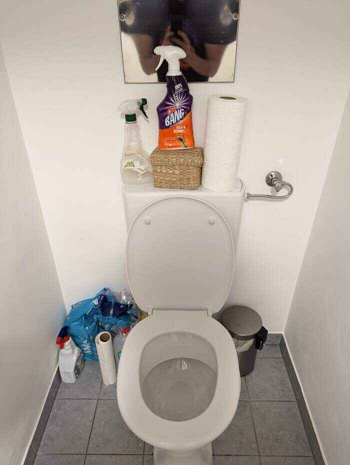

# Cleaning the puke

## Checking the flat for accidents
Please check the flat for puke stains and clean them with the respective cleaner.
You can find them in the toilet downstairs.
The parquet cleaner as the name suggests is for the wooden floor.
For the rest please use only a little of the other one.
Also use the toilet paper for cleaning and throwing everything in the toilet and flushing it then.

## Hold the door!
Please never close the human toilet door or seat, as the cats also like to pee there.
Would also check if there is something inside and flush/clean it then.

## Alternative toilets
Sometimes the cats don't got where they should do their business.
Lola likes to use the bathtub as her alternative toilet.
Please flush it if you see something in there.