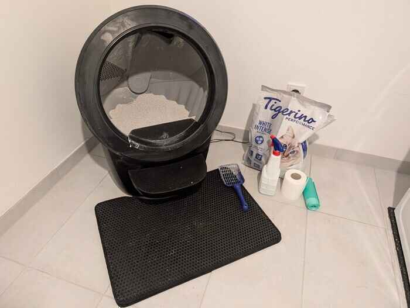
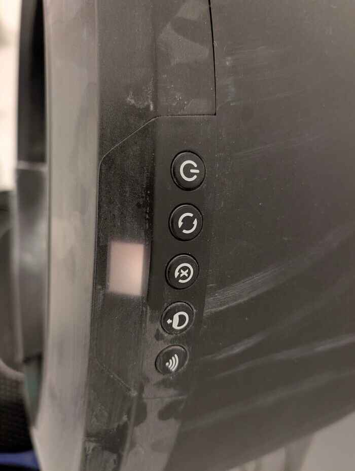

# Cleaning the toilet

## The good, the bad and the dirty
Where there is food there also is something brown to find.
The toilet is located in the cellar next to the washing machine (down the stairs and left)
The toilet is fully automated but still needs a little attention now and then.

## Red carpet
Please also clean the pellets that are in front of the cat toilet, just grab the vacuum and away they go.

## Throwing away that poo
When leaving the house at the beginning of the street there are 2 big general waste bins.

### Removing the used litter
Pack the sack and then put a new plastic bag in.
You get this bag right next to the toilet.

### Refill
New litter is always available next to the toilet.
Please check that you have it filled to the `max` line and press the 3rd and 2nd button after each other.
If it properly turns around you did everything correct, if it gets stuck, there may be too much litter in it.

### Buttons

1. On/off switch
2. Start a manual cleaning cycle
3. Press in case:
  - litter was filled in
  - the toilet stopped working and does not turn anymore
4. Empty the whole litter at once
5. Wifi
