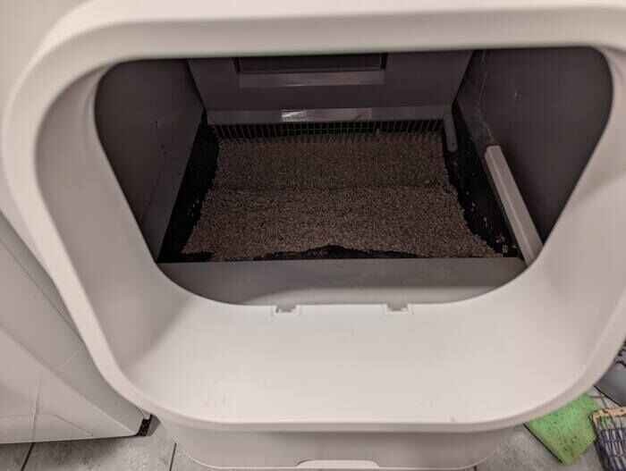
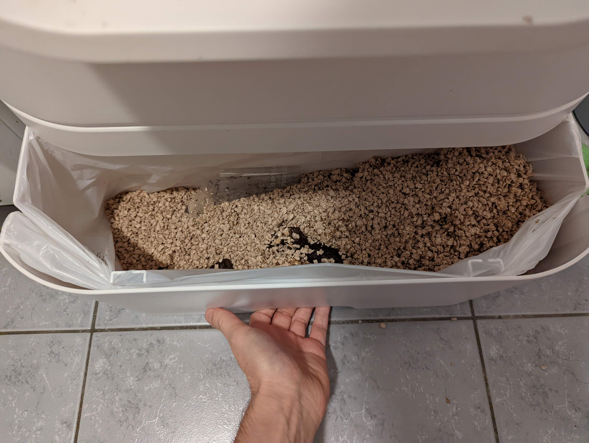
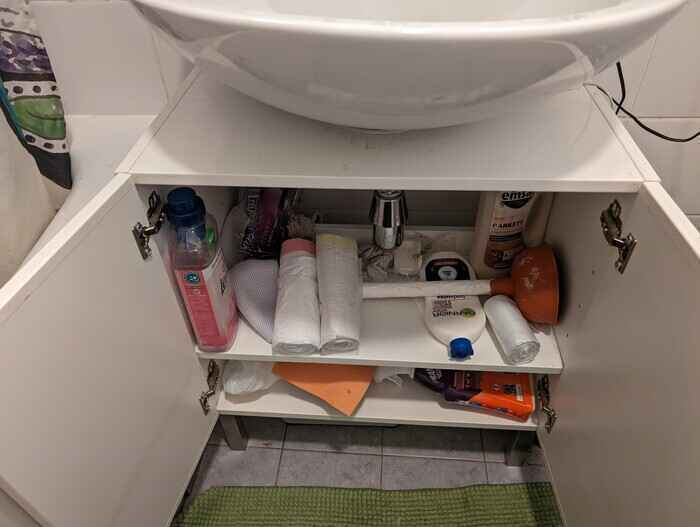
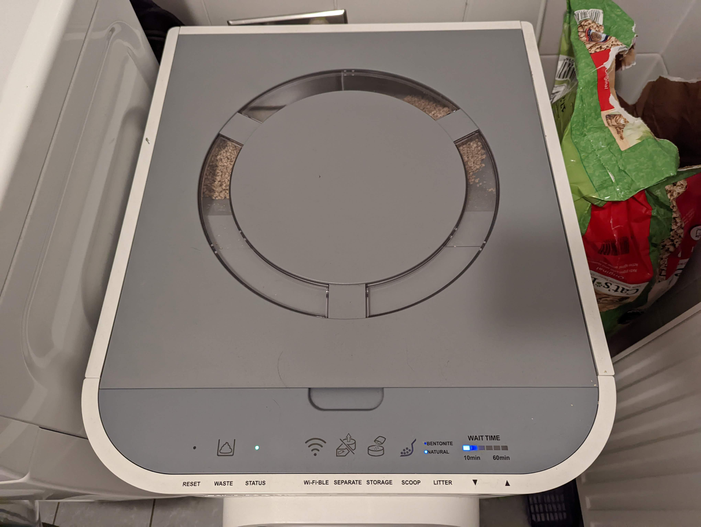
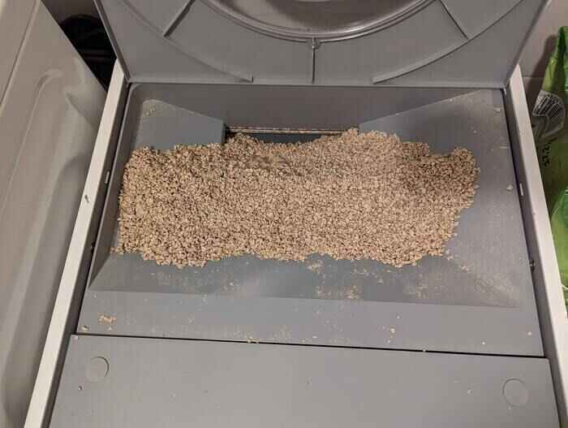
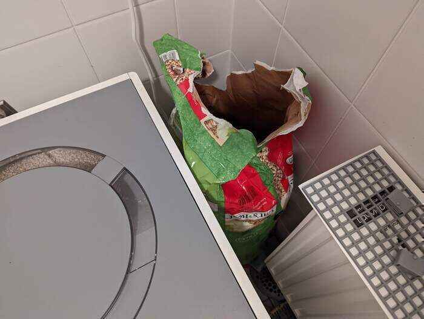
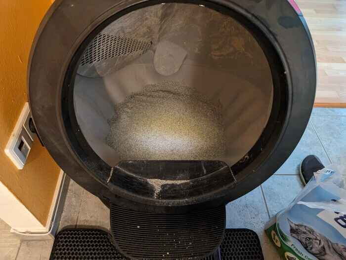

# Cleaning the toilet

## The good, the bad and the dirty
Where there is food there also is something brown to find.
Both toilets are located right after the entrance in the bathroom and hallway.
Both are fully automated but still need a little attention now and then.

## Red carpet
Please also clean the pellets that are in front of the cat toilet, just grab the vacuum and away they go.

## Throwing away that poo
When leaving the house right next to the entrance door there is the garbage room which you can open with the apartment key and throw it in there.

## White toilet specifics

### Cleaning the inside
Sometimes there is a little dirt sticking to the inside.
Take out the white grid on the front of the inside.

Please use the shovel on the right to scrap it off.
Put the grid back in when done.

### Removing the used litter
Check if the trash bin of the toilet is half full by pulling it out from below.

Pack the sack and then put a new plastic bag in.
You get this bag from underneath the sink in the bathroom or kitchen

### Restocking the litter

If the litter looks like it's getting to an end, please refill it at maximum so full it still is closable.
Open the top of the toilet.

Then use the litter right next to the toilet to fill it up.

### Unwanted tenants
In summer it's quite critical not to wait too long, as there might get some flies into the box and they will nest there, then also the cats don't like to go to the toilet there anymore.

## Black toilet details

### Removing the litter

The new litter is located next to the cat toilet.
Cleaning it is just pulling out the front bottom where the cats stand on and then place a new plastic bag into it.
There might be many different types of plastic bags in the bathroom under the sink, please choose a fitting one that can be fit without using force to stretch it.
If there is one with a red band, take this one.

### Stops or does not start turning or blinking red?

You have two options here, once is try pressing the second button from the top to start a manual cycle or the second approach is to turn it off and on again by pressing once the first button from the top, then wait till the light turns off and then turn it on again.

## Misinformation?!
If something is not where it should belong to, eg cleaning stuff, trash bags, please don't be shy and give me a call.