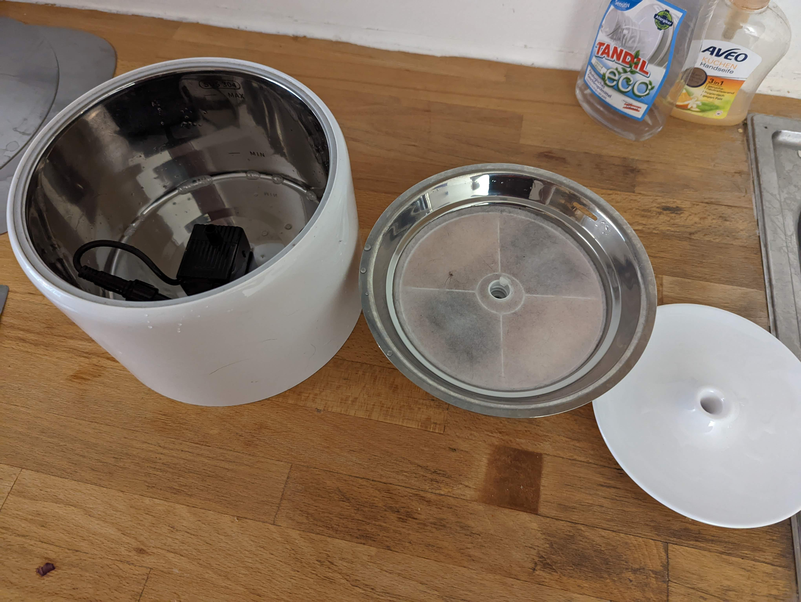
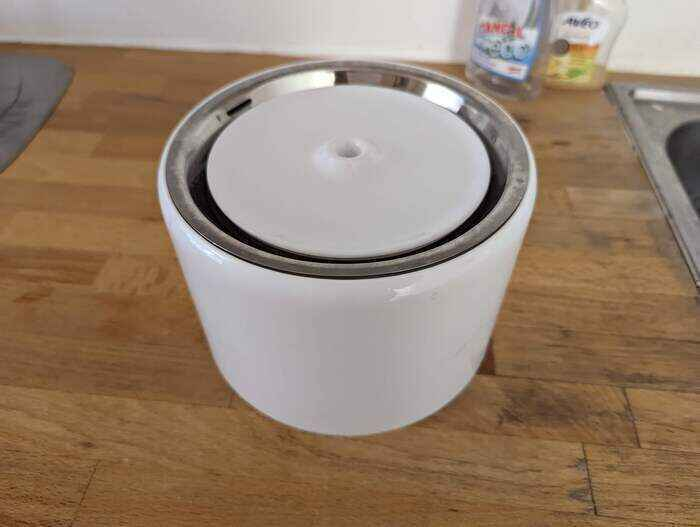

# Drinks

## Drinks on the house!
We have a fully automated water fountain for the cats, with a filter so the water does not get stale.

## Location
It's located upstairs in the bathroom.  
Please keep the door open so the cats can always reach it.

## Refill
Please refill it every wednesday and sunday with fresh water.
Or if you see it and there's no water coming out.

### How to
Pick up the top part by lifting it.
You don't need to unscrew the white top part from the metal part.
Fill in water until the max line.
Then put the metal part back on top again.

## Long maintenance
It needs to cleaned thoroughly once a week on Sunday.

### How to
Pick up the top part by lifting it.

### Disassembling
Turn the top white part to the left, then you can take it out.
Pick up the steel part.
Perfect you have disassembled it!

### Cleaning
Pour hot water over it and clean it with a towel.

### Filling
Pour cold water into it until you reach a little under the `max` line.

### Assembling again
Follow the steps in reverse order from [Disassembling](#disassembling).