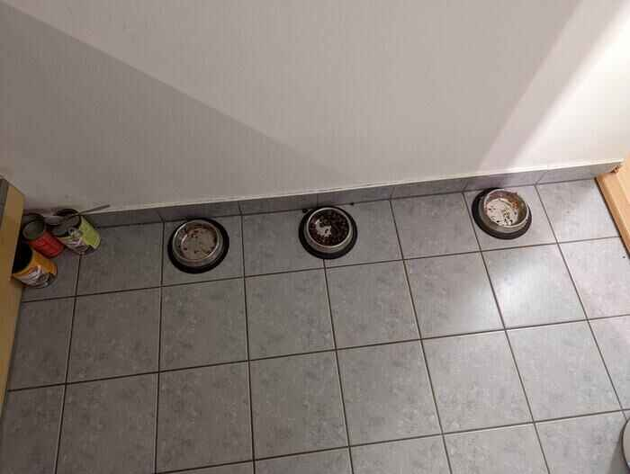
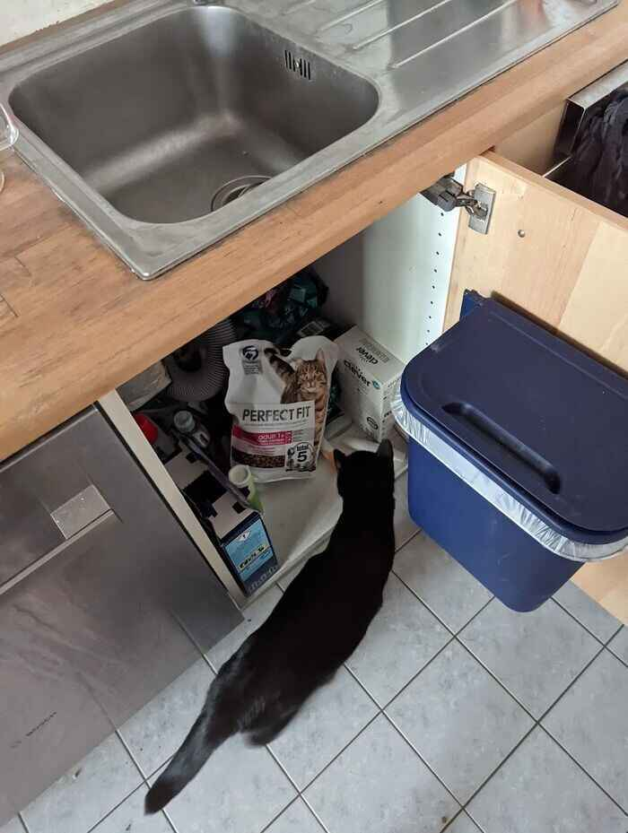
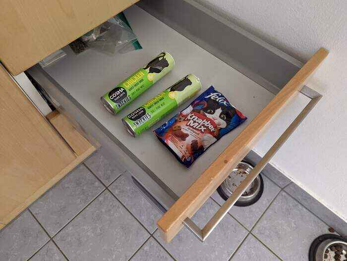
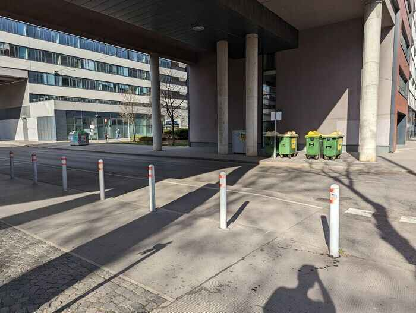

# Food habits

## 3 bowls?!? What is what

There should be one for the wet food and the other two for dry food.

## Time to feed!
Usually they like to eat in the morning at around 8:30 and in the evening at 17:30.
But as this would be a too high effort to feed them twice a day, it's enough if you can come by once a day.
At best typically in the morning, so they can keep on of their habits, but if it's not working for you once a day is also find, but morning is definitely preferred.

## Food location
All the wet food is located in the little room under the stairs.
Once open, put a lid on it and put it in the bottom right part of the fridge, so it doesn't get stale.
There are multiple packages of dry food under the kitchen sink.

## FOOD!
Wet food should be mixed with warm water as it's always cooled in the fridge.
Mix some super hot water and a few tablespoons (4-6) of wet food so the food has a proper temperature to not be too harsh on the kitties stomach.
Please check before leaving that dry food is always filled to the maximum in one can.

## Somebody said TREATS?!?
If they were well-behaved cats, or you just like that they like you more with treats, you can give them a few (5 max per cat).
They are in the kitchen drawer next to the cat bowls.

## Cleaning the bowls
The bowls should be cleaned about every two days, so there is no dirty smell that the cats don't like.
It's less of a problem with dry food, but still you would also take a new plate yourself every few days :).

## Recycling wet food cans
We don't like to put the cat food cans to the other trash that we have in-house, as they smell and are prone to attract insects.
Please try to throw them away after they are empty.
We have a garbage collection point 50 meters outside of our house.
If you leave the building and go to the left, under the bridge you can find the green garbage container.

