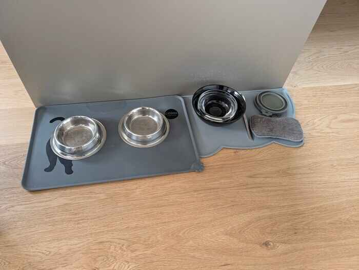
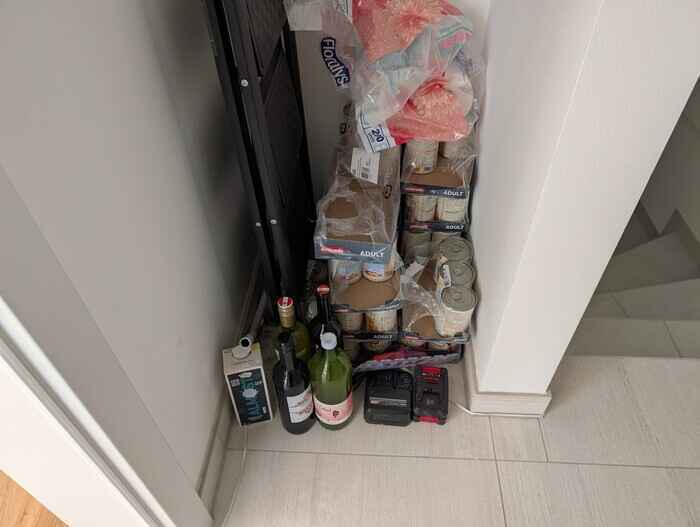
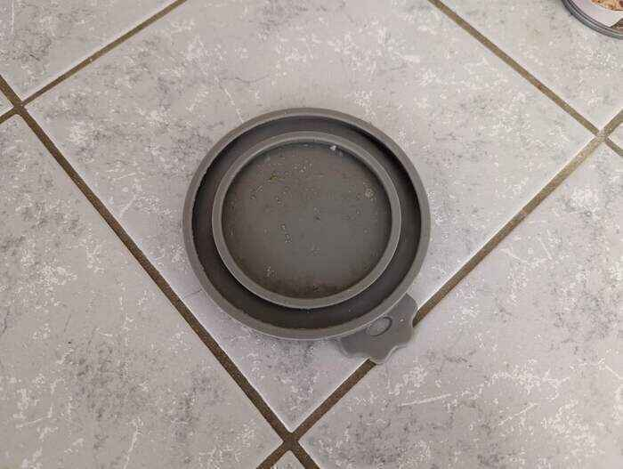
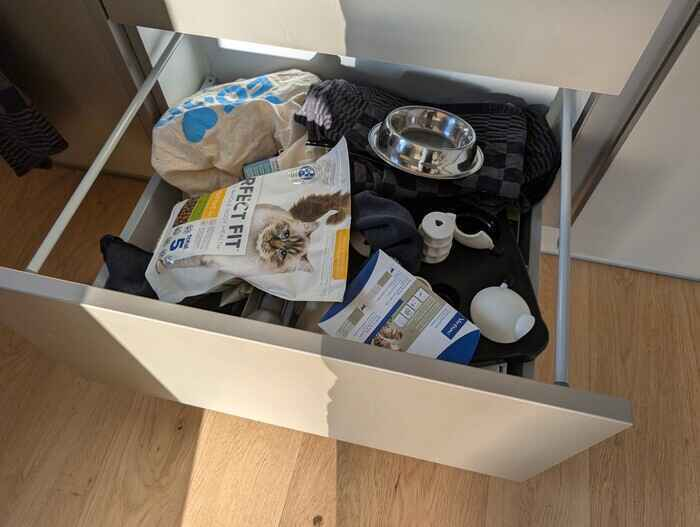

# Food habits

## 3 bowls?!? What is what

There should be one in the center for the dry food and the other two for wet food.
The left bowl is owned by Lola and the right bowl is the property of Luci.
Please put them to their respective bowl if you see them eating from the wrong one.

## Time to feed!
Usually they like to eat in the morning at around 8:30 and in the evening at 17:30.
But as this would be a too high effort to feed them twice a day, it's enough if you can come by once a day.
At best typically in the morning, so they can keep on of their habits, but if it's not working for you once a day is also fine, but morning is definitely preferred.

## Food location
All the wet food is located in the little space next to the stairs.

Once open, put a lid on it, so it doesn't get stale.

And please clean the spoon with water, so it does not smell too bad and has reisue of the food on it.
The dry food is located under oven.

<!-- ## FOOD!
Wet food should be mixed with warm water if it's coming from the fridge, as cold food is not good for the cats stomach.
Mix some super hot water and a few tablespoons (4-6) of wet food so the food has a proper temperature to not be too harsh on the kitties stomach.
Please check before leaving that dry food is always filled to the maximum in the center feeding bowl. -->

## Somebody said TREATS?!?
If they were well-behaved cats, or you just like that they like you more with treats, you can give them a few (5 max per cat).
They are also located next to the dry food.

## Cleaning the bowls
The bowls should be cleaned about every two days, so there is no dirty smell that the cats don't like.
It's less of a problem with dry food, but still you would also take a new plate yourself every few days :).
