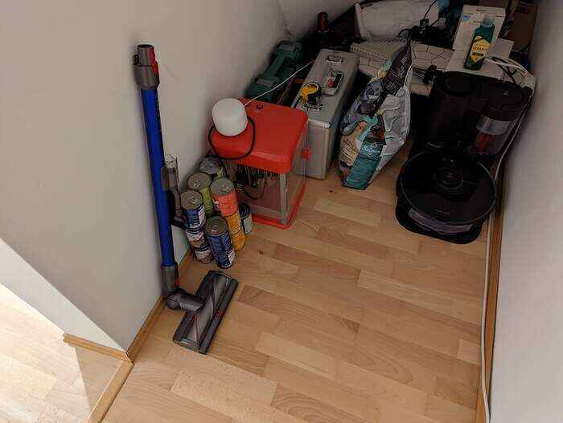
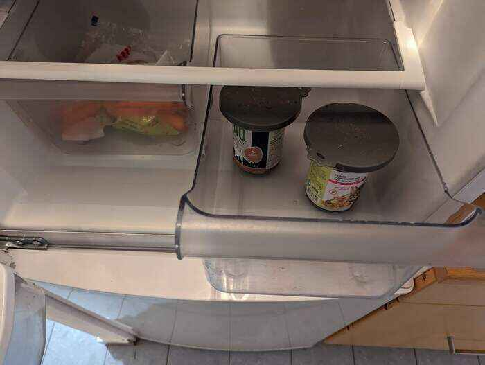

# Food habits

## 3 bowls?!? What is what

The middle bowl is the shared one which is for the dry food.
The left one is for `Lola` and the right one is for `Tama`, they are both for wet food only.
Please try to check that they eat only out of their respective bowl.

## Time to feed!
Usually they like to eat in the morning at around 8:30 and in the evening at 17:30.
But as this would be a too high effort to feed them twice a day, it's enough if you can come by once a day.
At best usually in the morning, so they can keep on of their habits, but if it's not working for you once a day is also find, but morning is definitely preferred.

## Portion size
Both cats together should eat about half a can of wet food and the rest dry food.
Please check before leaving that dry food is always filled to the maximum.

## Type of food
Usually I also mix two wet foods together, so they have a bit of diversity.
We also accidentally bought some dog food, which is fine if we give it to them not on a regular basis, as they would otherwise lack some nutrition.

## Diets
`Tama` needs more dry food as she otherwise gets diarrhea, which is not so nice to clean up in the toilet.
Please try to give her 1/4th of the spoon with her diarrhea medicine into her wet food and mix it properly otherwise she won't eat it.
You can find it right on the kitchen counter top above the cat bowls.

## Food location
All the food is located in the little room under the stairs.

## Unfinished wet food
Put them in the refrigerator on the right tray with a lid on, as the cats don't like the food if it's already one day old and they won't eat it then.

This food should be reused the next day, mixed with a little of hot water, so it's not too cold for the cats to eat.

## Somebody said TREATS?!?
If they were well-behaved cats, or you just like that they like you more with treats, you can give them a few (5 max per cat).
They are in the kitchen drawer next to the cat bowls.

## Cans
Please put the cans in the middle bin with the plastic bag, we'll recycle them later.
It's located right next to the lunch table.

