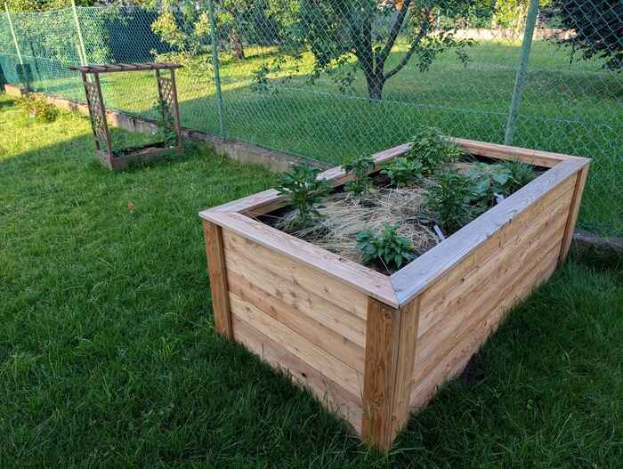
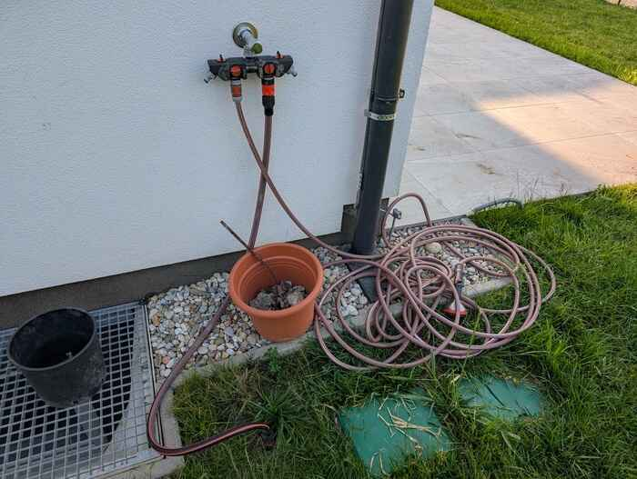

# Gardening

## Grass
We have an automated sprinkler system which you can turn on for like 10 minutes to water the whole garden.

## Raised beds
The vegetables (Chilis, basil, tomatoes) need some hand care with the water hose, as they are not integrated in the sprinkler system by now.

## Faucet

One hose is connected to the sprinkler system and one to the hand sprayer.  
It's enought to leave the silver knob on and just use the red knobs for turning the water on/off.

