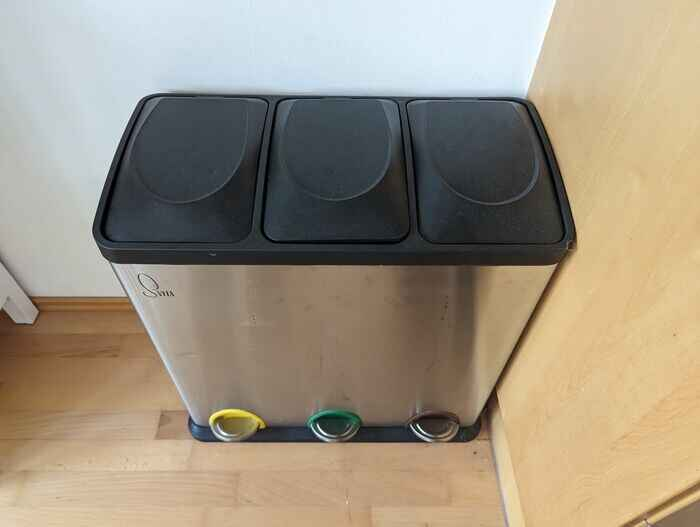

# Human trash
Humans also leave trash behind.
For this we have two trash bins, the one underneath the kitchen sink, which is general waste.
Then another one for recycling:

- Yellow: plastic bottles, cans, milk 
- Green: glass
- Brown: clean cardboard or paper